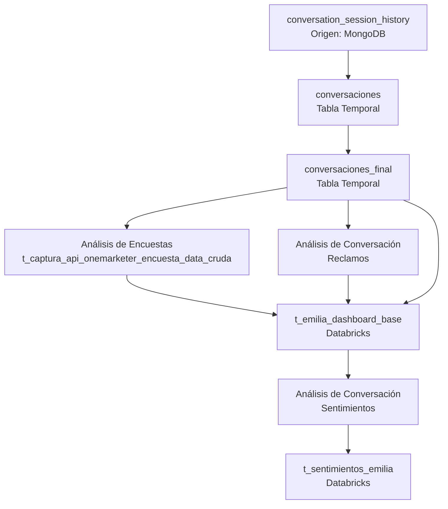

# ETL Data Process Emilia

Proyecto de ingeniería de datos desarrollado en **Python y PySpark** para la extracción, transformación, enriquecimiento y persistencia de información asociada a las conversaciones de Emilia.

El pipeline integra información proveniente de **MongoDB**, archivos locales y fuentes almacenadas en **Databricks**, ejecutando transformaciones mediante **Spark SQL y Python** para generar tablas analíticas persistidas en Databricks.

---

## Estructura del proyecto

```text id="3mmc76"
ETL_Data_Process_Emilia/
│
├── config/
│   ├── __init__.py
│   ├── config.py
│   ├── config_sql.json
│   └── log_config.py
│
├── data/
│   └── reclamos/
│
├── docs/
│   ├── estructura.txt
│   ├── mapear.py
│   ├── README.MD
│   └── sql_ddl.sql
│
├── logs/
│   └── ETL_Data_Process_Emilia.log
│
├── requirements/
│   ├── requirements-databricks.txt
│   └── requirements-local.txt
│
├── src/
│   │
│   ├── catalog/
│   │   ├── catalog_manager.py
│   │   ├── dataframe_manager.py
│   │   ├── models.py
│   │   ├── sql_manager.py
│   │   └── table_manager.py
│   │
│   ├── extract/
│   │   └── __init__.py
│   │
│   ├── flow/
│   │   └── flow.py
│   │
│   ├── infra/
│   │   ├── __init__.py
│   │   ├── databricks_client.py
│   │   ├── mongo_client.py
│   │   └── spark.py
│   │
│   ├── load/
│   │   ├── __init__.py
│   │   └── load_data_emilia.py
│   │
│   ├── sql/
│   │   ├── ddl/
│   │   │   ├── sentimientos_emilia.sql
│   │   │   └── t_emilia_dashboard_base.sql
│   │   │
│   │   └── queries/
│   │       ├── sentimientos_emilia.sql
│   │       └── t_emilia_dashboard_base.sql
│   │
│   ├── transform/
│   │   ├── __init__.py
│   │   └── bot_emilia_sentimientos.py
│   │
│   ├── utils/
│   │   ├── __init__.py
│   │   ├── bot_emilia_sentimientos_settings.py
│   │   └── utils.py
│   │
│   └── __init__.py
│
├── .env
├── .gitignore
└── main.ipynb
```

---

# Arquitectura del Proyecto

El proyecto utiliza una arquitectura modular orientada a un pipeline **ETL/ELT**, separando las responsabilidades de infraestructura, configuración, transformación, persistencia y orquestación.

```text id="vh5z3h"
                    ┌─────────────────────┐
                    │     main.ipynb      │
                    │  Punto de entrada   │
                    └──────────┬──────────┘
                               │
                               ▼
                    ┌─────────────────────┐
                    │      Flow Layer     │
                    │      flow.py        │
                    │    Orquestación     │
                    └──────────┬──────────┘
                               │
          ┌────────────────────┼────────────────────┐
          │                    │                    │
          ▼                    ▼                    ▼
   ┌─────────────┐      ┌─────────────┐      ┌─────────────┐
   │   Extract   │      │  Transform  │      │    Load     │
   │             │      │             │      │             │
   │ MongoDB     │      │ SQL         │      │ Databricks  │
   │ Databricks  │      │ Python      │      │ Delta       │
   │ Archivos    │      │ PySpark     │      │ Tables      │
   └──────┬──────┘      └──────┬──────┘      └──────▲──────┘
          │                    │                    │
          └────────────────────┼────────────────────┘
                               │
                               ▼
                    ┌─────────────────────┐
                    │    Catalog Layer    │
                    │                     │
                    │ CatalogManager      │
                    │ DataFrameManager    │
                    │ SQLManager          │
                    │ TableManager        │
                    └─────────────────────┘
```

---

# Flujo de procesamiento de datos

El pipeline comienza con la extracción del historial de conversaciones almacenado en MongoDB.

Los datos son transformados y enriquecidos mediante información de encuestas y análisis de reclamos. Posteriormente, se genera la tabla base utilizada para el análisis de sentimientos.



---

# Capas del proyecto

## Configuración — `config/`

Centraliza la configuración general de la aplicación.

### `config.py`

Responsable de cargar y exponer las configuraciones necesarias para la ejecución del proyecto.

### `config_sql.json`
Archivo de configuración utilizado para definir dinámicamente los procesos y tablas administrados por el pipeline.

Permite separar la configuración de la lógica de ejecución.

``` json
{
"tablas": [
            {
                "nombre": "nombre de la tabla SQL  ",
                "origen":"origen script python o con consulta sql (ejem: python/sql)",
                "catalog": "Catalogo  Darabricks",
                "schema": "schema  Darabricks",
                "python_path": "Si origen es python debe contner modulo (ejem:src.load.load_data_emilia)",
                "python_function":"Si origen es python debe tener funcion (ejem: nombre_funcion)",
                "query_sql_path": " Si origen es SQL de incluir el Path
                                   src/sql/queries/sentimientos_emilia.sql",
                "sql_create_path": "debe contener la consulta SQL con el script create table correspodiente
                                    src/sql/ddl/consulta.sql",
                "modo": "[merge/replace/]",
                "partition_by": "partition de la tabla ",
                "where":3,
                "primary_key":["columna 1","columna 2"],
                "descripcion": "Descripcion de la tabla"
            }            
        ]
}
```


### `log_config.py`

Centraliza la configuración del sistema de logging.
Los registros generados durante la ejecución son almacenados en:

```text id="99ejzp"
logs/ETL_Data_Process_Emilia.log
```

---

## Catálogo y administración — `src/catalog/`

Contiene las abstracciones utilizadas para administrar la configuración, los DataFrames, las consultas SQL y la persistencia de tablas.

### `catalog_manager.py`

Administra el catálogo de procesos y tablas definidos en la configuración.

### `models.py`

Contiene los modelos utilizados para representar las configuraciones del proyecto, como la definición de una tabla o proceso.

### `sql_manager.py`

Responsable de leer y administrar los archivos SQL utilizados por el pipeline.

```text id="u8bxks"
SQLManager
    │
    ▼
Archivo .sql
    │
    ▼
Spark SQL
    │
    ▼
DataFrame
```

### `dataframe_manager.py`

Administra operaciones relacionadas con la creación, transformación y normalización de DataFrames.

### `table_manager.py`

Encapsula las operaciones de persistencia sobre Databricks.

Entre sus responsabilidades se encuentran:

* Creación de tablas.
* Escritura de DataFrames.
* Sobrescritura de datos.
* Operaciones `MERGE`.
* Administración de particiones.
* Persistencia en formato Delta.

---

## Infraestructura — `src/infra/`

Centraliza las conexiones y componentes tecnológicos externos utilizados por el proyecto.

### `spark.py`

Administra la creación y recuperación de la sesión Spark.

### `databricks_client.py`

Gestiona la conexión y comunicación con Databricks.

### `mongo_client.py`

Gestiona la conexión y extracción de información desde MongoDB.

Esta separación permite desacoplar la lógica de negocio de los detalles de conexión a las plataformas externas.

---

## Transformación — `src/transform/`

Contiene procesos de transformación implementados mediante Python.

### `bot_emilia_sentimientos.py`

Implementa la lógica asociada al análisis de sentimientos de las conversaciones procesadas.

El flujo conceptual es:

```text id="x6i41c"
t_emilia_dashboard_base
          │
          ▼
bot_emilia_sentimientos.py
          │
          ▼
Análisis de conversaciones
          │
          ▼
t_sentimientos_emilia
```

---

## Carga — `src/load/`

Contiene la lógica específica para la carga y preparación de datos.

### `load_data_emilia.py`

Implementa procesos relacionados con la carga de información utilizada por el pipeline de Emilia.

---

## SQL — `src/sql/`

La lógica SQL se mantiene separada del código Python.

### `ddl/`

Contiene las sentencias de definición de las tablas finales.

```text id="zfsjly"
src/sql/ddl/
├── sentimientos_emilia.sql
└── t_emilia_dashboard_base.sql
```

### `queries/`

Contiene las consultas utilizadas para generar los DataFrames que posteriormente serán procesados o almacenados.

```text id="f5dd6r"
src/sql/queries/
├── sentimientos_emilia.sql
└── t_emilia_dashboard_base.sql
```

La separación entre `queries` y `ddl` permite distinguir claramente:

```text id="8lt31i"
queries/  → Cómo obtener y transformar los datos

ddl/      → Cómo definir la estructura de las tablas
```

---

## Orquestación — `src/flow/`

### `flow.py`

Contiene la coordinación de las diferentes etapas del pipeline.

La capa de flujo determina el orden de ejecución de los procesos y coordina los diferentes componentes del proyecto.

```text id="8d0kb9"
main.ipynb
     │
     ▼
  flow.py
     │
     ├──► Extracción
     │
     ├──► Generación de DataFrames
     │
     ├──► Transformaciones
     │
     ├──► Ejecución SQL
     │
     └──► Persistencia en Databricks
```

---

## Utilidades — `src/utils/`

Contiene funciones y configuraciones auxiliares reutilizadas por diferentes componentes.

### `utils.py`

Funciones generales de apoyo para el pipeline.

### `bot_emilia_sentimientos_settings.py`

Configuraciones específicas utilizadas por el proceso de análisis de sentimientos.

---

# Fuentes de datos

El pipeline utiliza diferentes fuentes de información.

| Fuente           | Uso                                    |
| ---------------- | -------------------------------------- |
| MongoDB          | Historial de conversaciones            |
| Databricks       | Tablas de origen y destino             |
| OneMarketer      | Información de encuestas               |
| Archivos locales | Información complementaria de reclamos |

---

# Tablas principales

## `conversation_session_history`

Fuente principal de conversaciones almacenada en MongoDB.

## `conversaciones`

Estructura temporal generada durante la transformación inicial.

## `conversaciones_final`

Estructura temporal consolidada utilizada para los procesos de enriquecimiento.

## `t_captura_api_onemarketer_encuesta_data_cruda`

Fuente utilizada para complementar las conversaciones con información de encuestas.

## `t_emilia_dashboard_base`

Tabla principal consolidada y almacenada en Databricks.

## `t_sentimientos_emilia`

Tabla resultante del proceso de análisis de sentimientos.

---

# Entornos de ejecución

El proyecto está diseñado para soportar dos contextos de ejecución.

## Entorno local

Las dependencias necesarias para ejecutar y desarrollar el proyecto localmente se encuentran en:

```text id="l1qhrq"
requirements/requirements-local.txt
```

Este entorno permite desarrollar, probar y depurar el pipeline desde una máquina local.

---

## Entorno Databricks

Las dependencias específicas para la ejecución dentro de Databricks se encuentran en:

```text id="rsb9rl"
requirements/requirements-databricks.txt
```

Separar ambos archivos permite evitar dependencias innecesarias o incompatibilidades entre los diferentes entornos.

---

# Punto de entrada

El punto de entrada del proyecto es:

```text id="cy4v4g"
main.ipynb
```

El notebook actúa como **runner u orquestador de alto nivel**.

La lógica principal del proyecto permanece encapsulada dentro de los módulos de `src/`, evitando concentrar toda la implementación dentro del notebook.

Conceptualmente:

```text id="9s1y60"
main.ipynb
    │
    │ importa
    ▼
src/
    │
    ├── configuración
    ├── infraestructura
    ├── managers
    ├── transformaciones
    └── flujo
```

Esto permite mantener el notebook liviano y utilizarlo principalmente como punto de ejecución.

---

# Tecnologías utilizadas

* Python
* PySpark
* Apache Spark
* Spark SQL
* Databricks
* Delta Lake
* MongoDB
* SQL
* JSON
* Jupyter Notebook
* Logging

---

# Definición técnica de la arquitectura

El proyecto puede definirse como:

> **Un pipeline ETL/ELT modular y configurable desarrollado en Python y PySpark, orientado al procesamiento de conversaciones y datos analíticos sobre Databricks, con integración a MongoDB, soporte para transformaciones SQL y Python, administración centralizada de metadatos y persistencia en tablas Delta.**

La arquitectura separa las responsabilidades en diferentes capas:

```text id="p8klhl"
┌──────────────────────────────────────┐
│          ORQUESTACIÓN                │
│       main.ipynb / flow.py           │
├──────────────────────────────────────┤
│          PROCESAMIENTO               │
│     SQL / Python / PySpark           │
├──────────────────────────────────────┤
│          ADMINISTRACIÓN              │
│ Catalog / DataFrame / SQL / Table    │
├──────────────────────────────────────┤
│          INFRAESTRUCTURA             │
│   Spark / MongoDB / Databricks       │
├──────────────────────────────────────┤
│          PERSISTENCIA                │
│       Delta Tables / Databricks      │
└──────────────────────────────────────┘
```

Esta organización permite mantener una separación clara entre:

* **Qué ejecutar:** configuración.
* **En qué orden ejecutar:** capa `flow`.
* **Cómo transformar:** SQL, Python y PySpark.
* **Cómo administrar los datos:** managers del catálogo.
* **Cómo conectarse:** capa de infraestructura.
* **Dónde persistir:** Databricks y Delta Lake.
